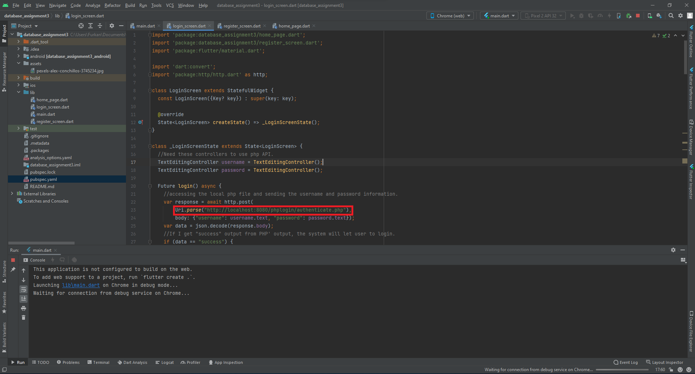
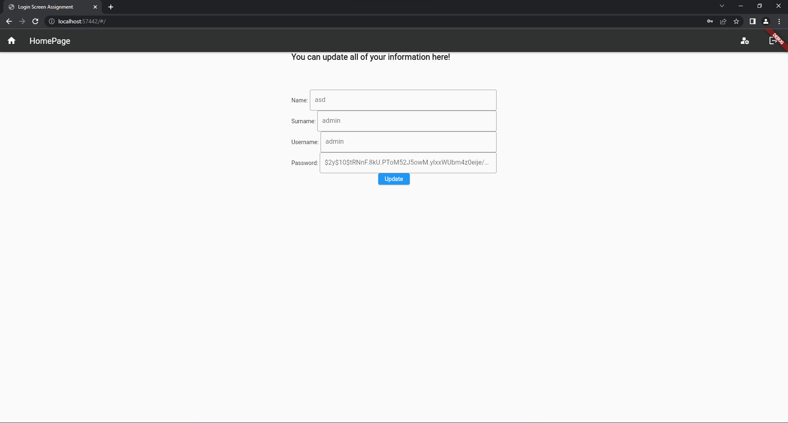

# QAUTH with PHP
- ## A authentication website written in PHP and Flutter. MySQL database is used to manage internal data.
# How to Setup
 ## 1. Download `furkan_unal_110510264.zip` file which includes all the necessary source files. 
 ## 2. Go to `C:\newxampp\htdocs` on your computer.
 ## 3. Create a new file in there and name it `phplogin`.   
 ## 4. Go to `phplogin` file you have just created.
 ## 5. Unzip the `furkan_unal_110510264.zip` here
 ## 6. Now you should create a database to store user data. To do that, open XAMPP.
 ## 7. Start Apache and MySQL modules. 
 ## 8. Click on Admin for MYSQL module and you will be navigated to the `phpMyAdmin` panel.
 ## 9. Create a new database and name it `authenticate`.
 
 ## 10. Go to `authenticate` and execute `ddl.sql`. This will create users table with the inital user (admin).
 ## 11. Before moving along, you have to assure you have right configuration for your local database in the code.
 ## 12. Make sure that you wrote the right database information in every PHP file (authenticate.php, register.php, getUserData.php, dataView.php, updateData.php).
 
 ## 13. This application is a WEB APPLICATION which is created with Flutter. Therefore make sure that your emulator is an internet browser.
 
 ## 14. After that make sure you wrote correct `.php` file locations into flutter(dart) files. (login_screen.dart, register_screen.dart, home_page.dart). 
 
 
 
 
 ## 15. After all of that, app should be run smoothly.
 
 ##Pages
 
 
 
 
